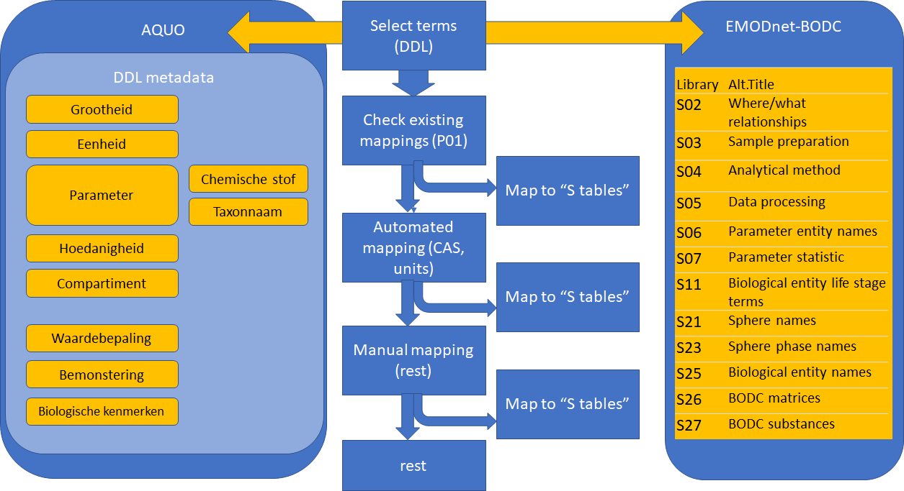

# Methodiek

## Afbakening

Het doel van dit project is om een semantische koppeling (mapping) vast te leggen voor het vertalen van Nederlandse zoutwatergerelateerde monitoringgegevens naar een internationale semantische standaard die gebruikt kan worden in EMODnet. De grootste bron van mariene gegevens wordt gevormd door de door Rijkswaterstaat ingewonnen gegevens in het kader van MWTL. Deze worden ontsloten via de Data Distributielaag. We hebben ons hier daarom beperkt tot alle soorten gegevens die via de Data Distributielaag beschikbaar wordt gemaakt.

## Algemene werkwijze

De algemene werkwijze is beschreven in figuur \@ref(fig:werkwijze). De volgende stappen worden gevolgd. Voor verdere uitleg over de standaarden wordt verwezen naar het desbetreffende hoofdstuk.

1.  DDL metadata unieke veldnamen worden geselecteerd
2.  DDL termen worden gecheckt met AQUO
3.  Metadata termen worden gemapt naar EMODnet/BODC met bestaande mappings van AQUO naar P01 (gearchiveerd bij AQUO)
4.  De mappings van 3 worden overgezet van P01 termen naar de onderliggende "S" termen.
5.  Overgebleven DDL metadata wordt gemapt via automatische procedures met termen uit een van de "S" tabellen. Dit kan door semantisch webtechnieken (chemische stof) of door tekstmatching (eenheid)
6.  Overgebleven DDL metadata termen worden met de hand gematcht naar BODC termen. Deze stap is tijdrovend, en is lastig te reproduceren of controleren.

(ref:werkwijze-label) Schematische weergave van de werkwijze voor mapping van AQUO semantische standaard naar internationaal gangbare (EDMODnet/BODC) standaard.

```{r werkwijze, out.width="100%", fig.cap="(ref:werkwijze-label)" }


```
